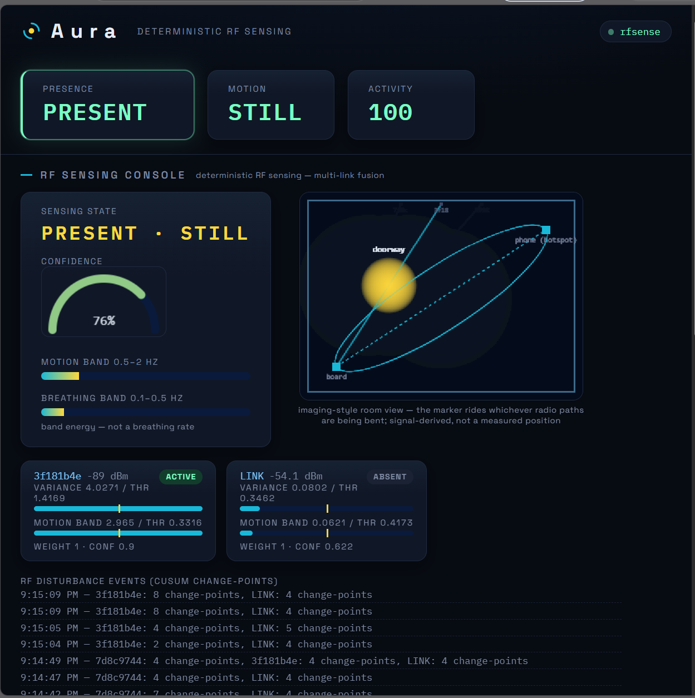
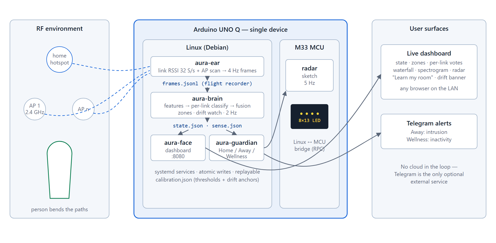

# Aura — camera-free presence AI on a bare Arduino UNO Q

[](https://github.com/amalnathkp13-boop/aura/actions/workflows/ci.yml)
[](LICENSE)
[](pyproject.toml)
[](tests/)
[](#architecture)

Every Arduino UNO Q already contains an invisible motion sensor: **its own radio**.
Aura turns it on with pure software — privacy-first presence, intrusion, and
wellness sensing for smart homes, with **zero extra hardware, zero cameras,
zero cloud, and zero training data**.

Built for the **Arduino Physical AI Challenge India 2026** (theme: *Smart Homes
& Consumer AI*) by Kumaravel S and Amalnath K P.
**[▶ Demo video](https://drive.google.com/file/d/16GfqoFsQ8vYzgybYod_s7oeFLkfacokY/view)** · [Project report (PDF)](docs/submission/Aura-Project-Report.pdf) · [Validation protocol](docs/validation-protocol.md)

<p align="center">
  
  <br><em>The RF Sensing Console — every decision traceable to a per-link threshold you calibrated.</em>
</p>

## Contents

- [What it does](#what-it-does)
- [Why it's different](#why-its-different)
- [Results](#results)
- [Reproduce on your PC — no hardware](#reproduce-on-your-pc--no-hardware)
- [Architecture](#architecture)
- [Detection pipeline](#detection-pipeline)
- [Quick start (on the board)](#quick-start-on-the-board)
- [Repository layout](#repository-layout)
- [Validation](#validation) · [Tests](#tests) · [Limitations & future work](#limitations--future-work)
- [Contributing](#contributing) · [License](#license) · [Competition submission](#competition-submission)

## What it does

- **Presence & motion detection** from disturbances people cause in the RF
  environment around the board — the WiFi link to the home hotspot plus every
  access point the radio can hear act as a mesh of invisible tripwires.
- **Zone localization**: after a 2-minute per-spot calibration, Aura labels
  *where* in the room the activity is (e.g. `doorway`, `center`).
- **Guardian modes**: *Home* (ambient awareness), *Away* (intrusion alerts via
  Telegram), *Wellness* (inactivity watch for elder care).
- **Live dashboard**: real detector internals — per-link votes, thresholds,
  vote fractions, an RF disturbance waterfall, a motion spectrogram, and an
  imaging-style radar visualization (deliberately abstract: RSSI carries no
  position information, and Aura never claims otherwise).
- **LED-matrix radar** on the board's front face, driven by the UNO Q's second
  brain (the STM32 M33) over the Linux↔MCU bridge.
- **Self-aware calibration**: a "Learn my room" flow derives per-link
  thresholds with a quality gate, and a drift detector raises a dashboard
  banner when the RF geometry has changed (e.g. the hotspot moved) instead of
  going silently blind.

## Why it's different

| Conventional smart-home sensing | Aura |
|---|---|
| Cameras (privacy risk, creep factor) | No optics at all — physically cannot take a picture |
| PIR / mmWave / BLE beacons (extra hardware) | Bill of materials: the UNO Q itself. Nothing else |
| Cloud AI (subscription, data exfiltration) | 100% on-device; works with the internet down |
| Black-box neural models | Deterministic, explainable signal processing — every decision traceable to a threshold you calibrated |

## Results

Scored live session, 23 Aug 2026, one operator, a real room, the hotspot
phone parked as the far end of the link (`data/validation/`). Numbers are the
output of `training/validate.py` on the published recording — not edited.

| Metric | **Aura** (fused `rfsense`) | Naive single-threshold baseline |
|---|---|---|
| Presence accuracy (294 windows) | **94.9 %** | 51.4 % |
| Motion accuracy (190 windows) | **91.6 %** | 77.9 % |
| False-motion windows in the empty room (0.23 h) | **0** | 30 |
| Doorway entries missed (4 entries) | **0** | 0 |
| Entry latency, windowed tool median | 18.2 s | 33.2 s |

The tool's latency has a ~15 s floor from the analysis window; the dashboard's
first reaction to an entry is faster (features update every ~2 s) and was
stopwatch-assessed during the session — see the report. Presence hysteresis
raised overall accuracy from 89.8 % to 94.9 % without adding a false alarm.

## Reproduce on your PC — no hardware

The scored session, its calibration and its truth timeline are in the repo.
Re-score them through the exact production detector:

```sh
git clone https://github.com/amalnathkp13-boop/aura.git && cd aura
python -m venv .venv && . .venv/bin/activate      # Windows: .venv\Scripts\activate
pip install -e ".[dev]"

# Aura's fused detector
python -m training.validate data/validation/session-2026-08-23-frames.jsonl data/validation/timeline.json --cal data/validation/calibration.json
# the naive baseline, same data
python -m training.validate data/validation/session-2026-08-23-frames.jsonl data/validation/timeline.json --cal data/validation/calibration.json --detector baseline

python -m pytest tests/        # 106 tests
```

`frames.jsonl` is also a flight recorder: `aura replay --session <file>` streams
any recording back through the live pipeline, so an incident can be re-run
offline through the same code that made the decision.

## Architecture

<p align="center">
  
</p>

<details>
<summary>Text version</summary>

```
             Arduino UNO Q (single device)
┌───────────────────────────────────────────────┐
│ Linux (Debian, Qualcomm QRB)     M33 MCU      │
│                                               │
│  aura-ear ──► frames.jsonl                    │
│  (radio listener, 4 Hz)   │                   │
│                           ▼                   │
│  aura-brain ──► state.json / sense.json       │
│  (feature extraction, │                       │
│   per-link classify,  │        LED matrix     │
│   multi-link fusion)  │        radar sketch   │
│                       ▼            ▲          │
│  aura-face (dashboard) ── HTTP ────┘          │
│  aura-guardian (modes, Telegram alerts)       │
└───────────────────────────────────────────────┘
```

</details>

File-based pipeline of systemd daemons; each stage is independently
restartable and replayable. `frames.jsonl` doubles as a flight recorder — any
live incident can be re-run offline through the exact detector for forensics.

## Detection pipeline

1. **Ear**: samples the connected-link RSSI (32 samples/s via station dump
   under a keep-alive ping) and scans neighbouring APs; writes 4 Hz frames.
2. **Features** (15-s sliding window, per channel): variance, motion-band
   (0.5–2 Hz) and breathing-band (0.1–0.5 Hz) FFT power, CUSUM change-points.
3. **Per-link classification** against calibrated thresholds, with
   cross-receiver agreement.
4. **Multi-link fusion** (Aura-original): every link votes with a stability
   weight; presence needs a strict weighted majority, so one glitching channel
   cannot raise an alarm. Presence holds 120 s past the last motion so a
   still person doesn't read as an empty room.
5. **Zones**: nearest calibrated per-channel disturbance signature
   (log-scaled variance / band-power distance).

The core feature extractor and rule classifier are adapted from an
MIT-licensed upstream project — full attribution, pinned upstream commit, and
license text in [NOTICE.md](NOTICE.md).

## Quick start (on the board)

```sh
sh deploy/push.sh                 # rsync-free tar deploy to ~/aura-src + venv install
sudo deploy/install.sh            # systemd units: aura-ear, aura-brain, aura-face, aura-guardian
# open http://<board>:8080  →  press "Learn my room" (10 min empty + 5 min walk)
sudo systemctl restart aura-brain # load the new calibration
```

Calibration rules that matter (learned the hard way): the hotspot phone is the
far end of the sensor — park it at the far side of the room, at waist height,
and don't touch it afterwards; the walk-phase quality gate refuses a
calibration that can't actually see you walk, and the drift banner tells you
when to redo it. Note the sensing zone includes the doorway — someone
lingering just outside the door is legitimately detected (the zone label will
say so).

## Repository layout

| Path | What it is |
|---|---|
| `aura/` | The product. `ear/` radio listener · `brain/` features, calibration, the `rfsense/` detector · `face/` Flask dashboard + M33 bridge · `guardian/` modes and Telegram · `labeler/` optional PC-side webcam truth-labeller (training-phase only, never on the board) · `cli.py` |
| `board-app/aura-matrix/` | The shipped LED-matrix radar as an Arduino App: Linux-side Python talks to the M33 sketch over RouterBridge |
| `sketch/aura_matrix/` | Earlier standalone serial-transport variant of the same matrix animation, kept for reference |
| `deploy/` | `push.sh` (tar deploy), `install.sh` (systemd units), `fix-net.sh` (hotspot gateway one-shot), `systemd/` |
| `training/` | `validate.py` — the scoring harness behind every number above — plus the retired CNN experiment (`train.py`, `dataset.py`, `label_stream.py`); the shipped detector uses no learned model |
| `data/validation/` | The scored 23-Aug session: frames, calibration, truth timeline, stopwatch taps, run card |
| `docs/` | Validation protocol · data log · day-1 spike results · [future work](docs/future-work.md) · `submission/` (report, diagram, video script) · `superpowers/` (design specs and implementation plans — the project's design history) |
| `tests/` | 106 tests: features, classification, fusion, calibration gates, drift, zones, services, dashboard API |

## Validation

`docs/validation-protocol.md` defines a scripted live session (empty /
entries / sitting / walking, with declared truth timeline);
`training/validate.py` scores recorded frames chronologically and reports
presence accuracy, entry latency, and false-alarm windows per empty hour, for
both the fused detector and a naive baseline. The full session log with phase
boundaries and post-mortem is in [`docs/data-log.md`](docs/data-log.md).

## Tests

106 automated tests cover feature extraction, classification, fusion,
calibration (including the walk gate and drift detection), zones, services,
and the dashboard API. They run on every push (Ubuntu, Python 3.11 and 3.13):

```sh
python -m pytest tests/
```

## Limitations & future work

Aura reports presence, motion, activity and a single zone label — it does
**not** count people. Multi-person behaviour was outside the validation
protocol and is not claimed. [`docs/future-work.md`](docs/future-work.md)
records what the current detector does with 2+ occupants and lays out four
routes toward a *nobody / one / more than one* answer on a bare UNO Q
(multi-zone decomposition, known-device BLE fusion, an ath10k spectral-scan
spike, and a multi-board mesh), in order of attack.

## Contributing

See [CONTRIBUTING.md](CONTRIBUTING.md) (setup, ground rules, PR checklist)
and [SECURITY.md](SECURITY.md) (private vulnerability reporting, deployment
notes). Release history is in [CHANGELOG.md](CHANGELOG.md).

## License

MIT (see [LICENSE](LICENSE)). Portions adapted from an MIT-licensed upstream
project — see [NOTICE.md](NOTICE.md).

## Competition submission

Built for the **Arduino Physical AI Challenge India 2026** — category
*Smart Homes & Consumer AI* — by **Kumaravel S** (team lead) and
**Amalnath K P**, Erode, Tamil Nadu. The submission bundle lives in
[`docs/submission/`](docs/submission/): the project report (PDF), the system
diagram, the demo-video script, and the console/board/alert images used in the
report.
